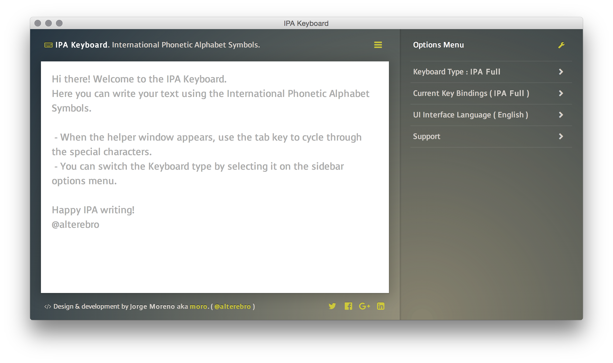

# IPA Keyboard: [git.io/ipa](http://git.io/ipa)

**International Phonetic Alphabet Symbols** Web and Desktop Application built using Vue.js, Gulp and Node-Webkit (nw.js). Responsive Cross-Browser Web Application and standalone Desktop Cross-Plattform Application for Mac OSX, Windows and Linux.

- WebApp : **[http://alterebro.github.io/IPA-Keyboard/](http://alterebro.github.io/IPA-Keyboard/)**
- Desktop App Pre-Release Binaries ( [v1.0-alpha pre-release page](https://github.com/alterebro/IPA-Keyboard/releases) ) :
    - **[Windows 64bit](https://github.com/alterebro/IPA-Keyboard/releases/download/1.0.0/ipa-keyboard-win64.zip)**
    - **[Mac OSX 64](https://github.com/alterebro/IPA-Keyboard/releases/download/1.0.0/ipa-keyboard-osx64.zip)**
    - **[Linux 64bit](https://github.com/alterebro/IPA-Keyboard/releases/download/1.0.0/ipa-keyboard-linux64.zip)**


[](http://alterebro.github.io/IPA-Keyboard/)

## Build

**Requirements** : **[Node.js](https://nodejs.org/en/)** and **[gulp](http://gulpjs.com/)**. Download and Install Node.js if you don't have it installed already on your computer from the [node website](https://nodejs.org/en/), install **gulp** globally. In case you have a previous gulp version run `npm rm --global gulp` in order to avoid collision with the *gulp-cli*.

```bash
# Install gulp globally
$ npm install --global gulp-cli  # ( with sudo on OSX )

# Clone the ipa keyboard repository
$ git clone https://github.com/alterebro/IPA-Keyboard

# Install development dependencies
$ npm install

# Build the www distributable folder
$ gulp build

# Build the nwjs app
$ gulp nw
```

When building the desktop app for specific operating system, modify the gulpfile.js file where the `nw` task contains a platform array, these are the possible values : `['win32', 'win64', 'osx32', 'osx64', 'linux32', 'linux64']` Just select those you want to be built. More info about the builder option s on the `nw-builder` repo page ( https://github.com/nwjs/nw-builder )


## Publish

Public website is generated on the `www/` folder and located on the gh-pages branch ( [http://alterebro.github.io/IPA-Keyboard/](http://alterebro.github.io/IPA-Keyboard/) ).
Build it with gulp and push only that folder to gh-pages.

```bash
# ... do your changes
# Build the www distributable folder
$ gulp build

# ... pushing master
$ git status
$ git add .
$ git commit -m 'commit message'
$ git push origin master

# push www/ to gh-pages
$ git subtree push --prefix www/ origin gh-pages
```

## Credits

**IPA Keyboard** by Jorge Moreno aka moro ([moro.es](http://moro.es), [@alterebro](https://twitter.com/alterebro))

- Built using :
    - **[NW.js (node-webkit)](http://nwjs.io/)** lets you call all Node.js modules directly from DOM and enables writing native applications with Web technologies.
    - **[Gulp](http://gulpjs.com/)** Task runner, streaming build system.
    - **[Vue.js](http://gulpjs.com/)** Reactive Components for Modern Web Interfaces.

---

The **IPA Keyboard** is [MIT licensed](https://github.com/alterebro/IPA-Keyboard/blob/master/LICENSE).
Copyright © 2016 Jorge Moreno
